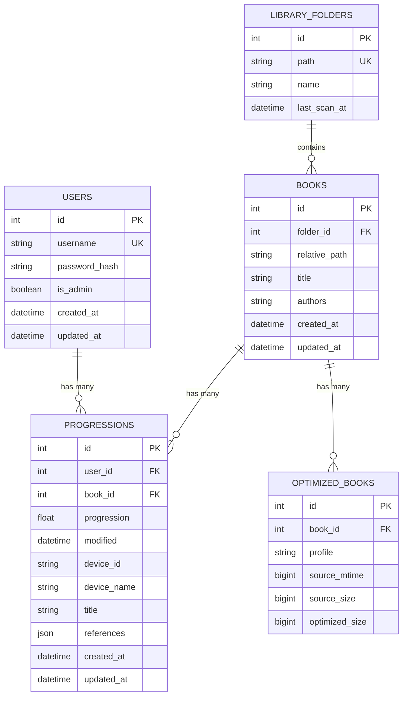

# BookFlow — Multi-User & Per-User Progression Plan

A detailed implementation specification for introducing multi-user support with per-user reading progression tracking in BookFlow.

---

## 1. Executive Summary & Goals

### 1.1 Objectives
- **Multi-user accounts:** Support multiple credentials stored securely in SQLite with Argon2id password hashing.
- **Isolated reading progression:** Each user maintains independent OPDS Progression 1.0 reading positions (`0.0`–`1.0`, timestamps, device information, and locator references) for every book in the library.
- **Role separation:** 
  - `Admin`: Full access to `/admin/` (folder management, library scanning, cache clearing, system diagnostics) plus user management.
  - `Reader`: Access restricted to OPDS feeds (`/opds`, `/opdsx3`, `/opdsx4`) and progression endpoints via HTTP Basic authentication. Any access to `/admin/` is strictly rejected.
- **Preserve core invariants:**
  - **The book library remains strictly read-only:** No filesystem write, rename, or delete operations occur in library folders.
  - **Shared device optimization cache:** The device cache (`data/cache/optimized/{x3,x4}/`) remains content-addressed per book file and device profile — cached renditions are shared across all users, avoiding redundant disk usage and CPU work.
  - **Lean single-process architecture:** No external services (no Redis, Celery, or microservices). All features run inside the existing SQLite + Flask architecture.
  - **Short SQLite sessions:** Database sessions are short-lived via `session_scope()`, never held across I/O, file transfers, or template renders.

### 1.2 Non-Goals
- No per-user library folders or access control lists (all users browse the same shared library).
- No web-based book reader or public user registration portal. Users are provisioned exclusively by an administrator via `/admin/users`.
- No per-device progression profiles (progression remains per logical user + book pair, as specified by OPDS Progression 1.0).

---

## 2. Architecture & Data Model



### 2.1 Schema Additions (`src/bookflow/database/models.py`)

#### 1. `User` Model
```python
class User(Base):
    """A user account for OPDS catalog access and admin operations."""

    __tablename__ = "users"

    id: Mapped[int] = mapped_column(Integer, primary_key=True)
    username: Mapped[str] = mapped_column(
        String(255), nullable=False, unique=True, index=True
    )
    password_hash: Mapped[str] = mapped_column(String(255), nullable=False)
    is_admin: Mapped[bool] = mapped_column(
        Boolean, nullable=False, default=False
    )

    created_at: Mapped[datetime] = mapped_column(
        DateTime, nullable=False, server_default=func.now()
    )
    updated_at: Mapped[datetime] = mapped_column(
        DateTime,
        nullable=False,
        server_default=func.now(),
        onupdate=func.now(),
    )

    progressions: Mapped[list[Progression]] = relationship(
        back_populates="user", cascade="all, delete-orphan"
    )
```

#### 2. Updated `Progression` Model
Replace the existing 1:1 `book_id` unique constraint with a composite `(user_id, book_id)` constraint:

```python
class Progression(Base):
    """Latest reading progression for a book per user."""

    __tablename__ = "progressions"
    __table_args__ = (
        UniqueConstraint("user_id", "book_id", name="uq_progressions_user_book"),
    )

    id: Mapped[int] = mapped_column(Integer, primary_key=True)
    user_id: Mapped[int] = mapped_column(
        ForeignKey("users.id", ondelete="CASCADE"), nullable=False, index=True
    )
    book_id: Mapped[int] = mapped_column(
        ForeignKey("books.id", ondelete="CASCADE"), nullable=False, index=True
    )

    progression: Mapped[float | None] = mapped_column(JSON, nullable=True)
    modified: Mapped[datetime | None] = mapped_column(DateTime, nullable=True)
    device_id: Mapped[str | None] = mapped_column(String(255), nullable=True)
    device_name: Mapped[str | None] = mapped_column(String(255), nullable=True)
    title: Mapped[str | None] = mapped_column(String(1024), nullable=True)
    references: Mapped[list | dict | None] = mapped_column(JSON, nullable=True)

    created_at: Mapped[datetime] = mapped_column(
        DateTime, nullable=False, server_default=func.now()
    )
    updated_at: Mapped[datetime] = mapped_column(
        DateTime, nullable=False, server_default=func.now(), onupdate=func.now()
    )

    user: Mapped[User] = relationship(back_populates="progressions")
    book: Mapped[Book] = relationship(back_populates="progressions")
```

#### 3. Updated `Book` Relationship
In `Book` (`src/bookflow/database/models.py`), update the progression relationship:
```python
    progressions: Mapped[list[Progression]] = relationship(
        back_populates="book", cascade="all, delete-orphan"
    )
```

---

### 2.2 Alembic Migration (`migrations/versions/0004_multi_user.py`)

Because SQLite requires table recreations for foreign key constraint additions and dropping unique constraints, Alembic's batch operations (`op.batch_alter_table`) are mandatory.

```python
"""Multi-user accounts and per-user progression tracking.

Revision ID: 0004
Revises: 0003
Create Date: 2026-10-04
"""
from collections.abc import Sequence
import secrets
from alembic import op
import sqlalchemy as sa
from argon2 import PasswordHasher
from bookflow.config import Settings

revision: str = "0004"
down_revision: str | Sequence[str] | None = "0003"
branch_labels: str | Sequence[str] | None = None
depends_on: str | Sequence[str] | None = None


def upgrade() -> None:
    # 1. Create users table
    op.create_table(
        "users",
        sa.Column("id", sa.Integer(), nullable=False),
        sa.Column("username", sa.String(length=255), nullable=False),
        sa.Column("password_hash", sa.String(length=255), nullable=False),
        sa.Column("is_admin", sa.Boolean(), nullable=False, server_default=sa.false()),
        sa.Column("created_at", sa.DateTime(), server_default=sa.func.now(), nullable=False),
        sa.Column("updated_at", sa.DateTime(), server_default=sa.func.now(), nullable=False),
        sa.PrimaryKeyConstraint("id"),
        sa.UniqueConstraint("username", name="uq_users_username"),
    )
    op.create_index("ix_users_username", "users", ["username"], unique=True)

    # 2. Seed initial admin account
    settings = Settings.from_env()
    admin_user = settings.admin_username or "admin"
    admin_pass = settings.admin_password or secrets.token_urlsafe(18)
    admin_hash = PasswordHasher().hash(admin_pass)

    users_table = sa.table(
        "users",
        sa.column("id", sa.Integer),
        sa.column("username", sa.String),
        sa.column("password_hash", sa.String),
        sa.column("is_admin", sa.Boolean),
    )
    op.bulk_insert(
        users_table,
        [{"username": admin_user, "password_hash": admin_hash, "is_admin": True}],
    )

    # Fetch seeded admin ID
    conn = op.get_bind()
    admin_id = conn.execute(
        sa.text("SELECT id FROM users WHERE username = :u"), {"u": admin_user}
    ).scalar()

    # 3. Migrate progressions table
    with op.batch_alter_table("progressions", schema=None) as batch_op:
        batch_op.add_column(sa.Column("user_id", sa.Integer(), nullable=True))

    # Backfill existing progression rows with the admin user id
    if admin_id is not None:
        op.execute(
            sa.text(f"UPDATE progressions SET user_id = {admin_id} WHERE user_id IS NULL")
        )

    with op.batch_alter_table("progressions", schema=None) as batch_op:
        batch_op.alter_column("user_id", nullable=False, existing_type=sa.Integer())
        batch_op.create_foreign_key(
            "fk_progressions_user_id", "users", ["user_id"], ["id"], ondelete="CASCADE"
        )
        batch_op.drop_constraint("uq_progressions_book_id", type_="unique")
        batch_op.create_unique_constraint(
            "uq_progressions_user_book", ["user_id", "book_id"]
        )
        batch_op.create_index("ix_progressions_user_id", ["user_id"])


def downgrade() -> None:
    with op.batch_alter_table("progressions", schema=None) as batch_op:
        batch_op.drop_index("ix_progressions_user_id")
        batch_op.drop_constraint("uq_progressions_user_book", type_="unique")
        batch_op.drop_constraint("fk_progressions_user_id", type_="foreignkey")
        # Ensure only 1 row per book before re-adding unique constraint
        # (keeps the most recently modified progression per book)
    
    # Prune duplicate progressions across users if downgrading
    conn = op.get_bind()
    conn.execute(sa.text("""
        DELETE FROM progressions 
        WHERE id NOT IN (
            SELECT p1.id FROM progressions p1
            JOIN (
                SELECT book_id, MAX(COALESCE(modified, created_at)) as max_mod
                FROM progressions GROUP BY book_id
            ) p2 ON p1.book_id = p2.book_id AND COALESCE(p1.modified, p1.created_at) = p2.max_mod
        )
    """))

    with op.batch_alter_table("progressions", schema=None) as batch_op:
        batch_op.create_unique_constraint("uq_progressions_book_id", ["book_id"])
        batch_op.drop_column("user_id")

    op.drop_index("ix_users_username", table_name="users")
    op.drop_table("users")
```

---

## 3. Authentication Subsystem

### 3.1 Authenticated User Representation
To respect the invariant *"Keep sessions short; never hold one across I/O or renders"*, credentials lookup yields a decoupled, lightweight data structure:

```python
from dataclasses import dataclass

@dataclass(frozen=True)
class AuthenticatedUser:
    """Decoupled user context attached to request g."""
    id: int
    username: str
    is_admin: bool
```

### 3.2 Database-Backed Credential Verification (`src/bookflow/auth/service.py`)

Refactor `PasswordVerifier` into `DatabasePasswordVerifier` (or update `PasswordVerifier` to query SQLite):

```python
class DatabasePasswordVerifier:
    """Verifies credentials against the SQLite database with timing attack mitigation."""

    def __init__(self, hasher: PasswordHasher | None = None) -> None:
        self._hasher = hasher or PasswordHasher()
        # Precompute dummy hash for constant-time comparison when user does not exist
        self._dummy_hash = self._hasher.hash("bookflow-timing-defense")

    def verify_user(self, username: str, password: str) -> AuthenticatedUser | None:
        """Verify username and password, returning an AuthenticatedUser if valid."""
        if not username or not password:
            return None

        clean_username = username.strip()
        user_row = None
        try:
            with session_scope() as session:
                user = session.scalar(
                    select(User).where(User.username == clean_username)
                )
                if user is not None:
                    user_row = (user.id, user.username, user.password_hash, user.is_admin)
        except Exception:
            # Handles uninitialized/unmigrated DB gracefully
            return None

        if user_row is None:
            # Constant-time mitigation against user enumeration
            try:
                self._hasher.verify(self._dummy_hash, password)
            except Exception:
                pass
            return None

        user_id, uname, p_hash, is_admin = user_row
        try:
            self._hasher.verify(p_hash, password)
            return AuthenticatedUser(id=user_id, username=uname, is_admin=is_admin)
        except (InvalidHashError, VerificationError):
            return None
```

### 3.3 Application Bootstrap & Admin Sync (`src/bookflow/app.py`)
To preserve single-binary and container convenience where `OPDS_ADMIN_PASSWORD` can be set or updated via environment variables:

```python
def ensure_admin_user(settings: Settings) -> None:
    """Ensure the configured OPDS_ADMIN_USERNAME exists with OPDS_ADMIN_PASSWORD."""
    if not settings.admin_password:
        return
    try:
        with session_scope() as session:
            admin = session.scalar(
                select(User).where(User.username == settings.admin_username)
            )
            hasher = PasswordHasher()
            if admin is None:
                session.add(
                    User(
                        username=settings.admin_username,
                        password_hash=hasher.hash(settings.admin_password),
                        is_admin=True,
                    )
                )
            else:
                # Synchronize password hash if changed in environment
                try:
                    hasher.verify(admin.password_hash, settings.admin_password)
                except (InvalidHashError, VerificationError):
                    admin.password_hash = hasher.hash(settings.admin_password)
                    admin.is_admin = True
    except OperationalError:
        # Ignore if tables do not exist yet before migration
        pass
```

Call `ensure_admin_user(settings)` in `create_app()` after `init_engine(settings)`.

### 3.4 Rate Limiting & Admin Session Authentication
- **Rate Limiter:** `LoginRateLimiter` remains keyed on `(request.remote_addr, username)` — no change required.
- **`POST /admin/login` (`src/bookflow/auth/routes.py`):**
  1. Key rate limiter on `(remote_addr, username)`.
  2. Verify credentials using `verifier.verify_user(username, password)`.
  3. If user is found but `not user.is_admin`:
     - Rate limiter counts as failure.
     - Return `403` with flash message: *"Reader accounts cannot access the administration dashboard."*
  4. If valid admin:
     - Reset rate limiter.
     - Rotate session (`session.clear()`).
     - Store `session["user_id"] = user.id`, `session["username"] = user.username`, `session[ADMIN_SESSION_KEY] = True`.
     - Generate CSRF token.
     - Safe redirect to target.

---

## 4. OPDS & Progression Subsystems

### 4.1 OPDS HTTP Basic Authentication (`src/bookflow/opds/auth.py`)
Update `require_basic_auth()` to authenticate via `DatabasePasswordVerifier` and attach the user to `flask.g`:

```python
def authenticate(
    verifier: DatabasePasswordVerifier, authorization: Authorization | None
) -> Response | None:
    """Enforce HTTP Basic credentials and bind AuthenticatedUser to flask.g."""
    if authorization is None or authorization.type != "basic":
        return unauthorized()

    user = verifier.verify_user(authorization.username, authorization.password)
    if user is None:
        return unauthorized()

    g.current_user = user
    return None
```
- When unauthenticated or failed, returns HTTP 401 with the OPDS Authentication Document (`application/opds-authentication+json`) as per specification.
- Both `Admin` and `Reader` users have access to OPDS feeds.

### 4.2 In-Process Concurrency Locks (`src/bookflow/optimizer/locks.py`)
Change `progression_lock` to key on `(user_id, book_id)` instead of `book_id`:

```python
_progression_locks: dict[tuple[int, int], threading.Lock] = {}

def progression_lock(user_id: int, book_id: int) -> threading.Lock:
    """Return the lock guarding one user's reading progression for a book."""
    key = (user_id, book_id)
    with _locks_guard:
        lock = _progression_locks.get(key)
        if lock is None:
            lock = threading.Lock()
            _progression_locks[key] = lock
        return lock
```
*Benefit:* User A saving progression on Book 10 will never block User B saving progression on Book 10.

### 4.3 Progression Endpoints (`src/bookflow/opds/progression.py`)
- **`GET /opds/publications/<int:book_id>/progression`:**
  ```python
  with session_scope() as session:
      if session.get(Book, book_id) is None:
          abort(404)
      row = session.scalar(
          select(Progression).where(
              Progression.user_id == g.current_user.id,
              Progression.book_id == book_id,
          )
      )
      if row is None:
          return Response(b"", content_type=PROGRESSION_TYPE)
      body = json.dumps(_to_document(row))
  return Response(body, content_type=PROGRESSION_TYPE)
  ```
- **`PUT /opds/publications/<int:book_id>/progression`:**
  ```python
  user_id = g.current_user.id
  with progression_lock(user_id, book_id), session_scope() as session:
      if session.get(Book, book_id) is None:
          abort(404)
      if request.mimetype != PROGRESSION_TYPE:
          abort(400)
      try:
          payload = json.loads(request.get_data(cache=False, as_text=True))
          document = _parse_document(payload)
      except (ValueError, UnicodeDecodeError):
          abort(400)

      row = session.scalar(
          select(Progression).where(
              Progression.user_id == user_id,
              Progression.book_id == book_id,
          )
      )
      created = row is None
      if created:
          row = Progression(user_id=user_id, book_id=book_id)
          session.add(row)
      elif row.modified is not None and document.modified < _as_aware(row.modified):
          abort(409)

      row.progression = document.progression
      row.modified = _as_naive(document.modified)
      row.device_id = document.device_id
      row.device_name = document.device_name
      row.title = document.title
      row.references = document.references
      session.flush()
      body = json.dumps(_to_document(row))

  return Response(body, status=201 if created else 200, content_type=PROGRESSION_TYPE)
  ```

---

## 5. Admin Interface: User Management

Add a dedicated user management section in `src/bookflow/admin/routes.py` protected by `@login_required` and CSRF validation.

### 5.1 Endpoints
| Method | Path | Action | Rules / Protection |
| --- | --- | --- | --- |
| `GET` | `/admin/users` | List all users | Displays username, role badge, creation date, and number of books tracked. |
| `GET` | `/admin/users/new` | User creation form | Renders `templates/add_user.html`. |
| `POST` | `/admin/users` | Create user | Validates username (alphanumeric + `_.-`, unique) and password (≥8 chars). Flashes errors/success. |
| `POST` | `/admin/users/<id>/password` | Change user password | Validates new password length. |
| `POST` | `/admin/users/<id>/delete` | Delete user account | **Safety checks:**<br>1. Cannot delete self (`id == session["user_id"]`).<br>2. Cannot delete the last remaining administrator account. |

### 5.2 UI & Templates
1. **`templates/layout.html`:**
   - Add **"Users"** to the navigation menu between "Folders" and "Health" when signed in.
2. **`templates/users.html`:**
   - Table of users showing:
     - Username
     - Role (`badge-ok` for Administrator, `badge-muted` for Reader)
     - Created timestamp
     - Books in Progress count
     - Inline password reset form / modal
     - Delete button with CSRF token and confirm dialog.
3. **`templates/add_user.html`:**
   - Clean form styled with `form-group`, `input-text`, `checkbox`, and action buttons matching `add_folder.html`.

---

## 6. System Diagnostics & Health (`src/bookflow/health/service.py`)

Update `library_statistics()` to include user-aware aggregates:
- `users`: Total accounts, total administrators, total readers.
- `progression`: Active readers count (users with ≥1 progression entry), total progression rows across all users, and unique device count.
- Update `templates/health.html` to display these metrics.

---

## 7. Optional Future Enhancement: OPDS "Continue Reading" Feed

Expose personalized reading shelves in the OPDS catalog:
- Endpoints: `/opds/reading`, `/opdsx3/reading`, `/opdsx4/reading`.
- Query:
  ```python
  select(Book).join(Progression).where(
      Progression.user_id == g.current_user.id,
      Progression.progression > 0.0,
      Progression.progression < 1.0,
  ).order_by(Progression.modified.desc()).limit(50)
  ```
- Expose discovery link in catalog root:
  `<link rel="http://opds-spec.org/shelf" href="/opds/reading" type="application/atom+xml;profile=opds-catalog;kind=acquisition" title="Continue Reading"/>`.

---

## 8. Implementation Roadmap & Step-by-Step Checklist

### Phase 1: Database & Migration
- [ ] Add `User` model to `src/bookflow/database/models.py`.
- [ ] Update `Progression` model with `user_id` FK and `UniqueConstraint("user_id", "book_id")`.
- [ ] Update `Book.progressions` relationship.
- [ ] Create Alembic revision `migrations/versions/0004_multi_user.py` using SQLite batch operations and admin seeding.
- [ ] Update `tests/test_database.py` to verify migration upgrade and rollback.

### Phase 2: Authentication Core
- [ ] Implement `AuthenticatedUser` and `DatabasePasswordVerifier` in `src/bookflow/auth/service.py`.
- [ ] Add `ensure_admin_user()` startup sync in `src/bookflow/app.py`.
- [ ] Update `require_basic_auth` in `src/bookflow/opds/auth.py` to verify users in SQLite and bind `g.current_user`.
- [ ] Update `POST /admin/login` in `src/bookflow/auth/routes.py` to block reader accounts and set user session data.

### Phase 3: Progression & Concurrency
- [ ] Update `progression_lock` in `src/bookflow/optimizer/locks.py` to accept `(user_id, book_id)`.
- [ ] Update `publication_progression` (`GET`) and `update_publication_progression` (`PUT`) in `src/bookflow/opds/progression.py` to filter/upsert per `g.current_user.id`.
- [ ] Update `tests/test_progression.py` to assert multi-user position isolation and concurrent updates.

### Phase 4: Admin Management
- [ ] Add user CRUD routes (`/admin/users*`) in `src/bookflow/admin/routes.py` with self-deletion and last-admin guards.
- [ ] Create templates `templates/users.html` and `templates/add_user.html`.
- [ ] Add "Users" link to `templates/layout.html`.
- [ ] Update `src/bookflow/health/service.py` and `templates/health.html` with user counts.

### Phase 5: Verification & Test Suite
- [ ] Add user creation helpers to `tests/factories.py`.
- [ ] Add user administration tests in `tests/test_admin.py` or new `tests/test_users.py`.
- [ ] Run complete test suite and linters:
  ```bash
  uv run ruff check .
  uv run pytest -q
  ```
